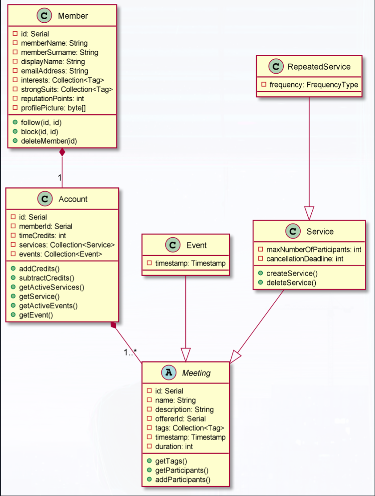
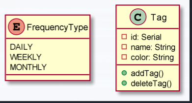

# swe573-Project
Project repository for SWE573 - Software Development Practice 

The diagrams branch contains the UML class and sequence diagrams for the core features of this project. 

The screenshots of the diagrams generated by PlantUML files can be found below:

* Class Diagrams:
  

* Models:
  